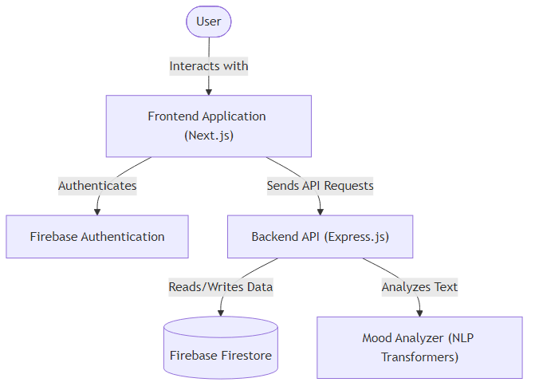
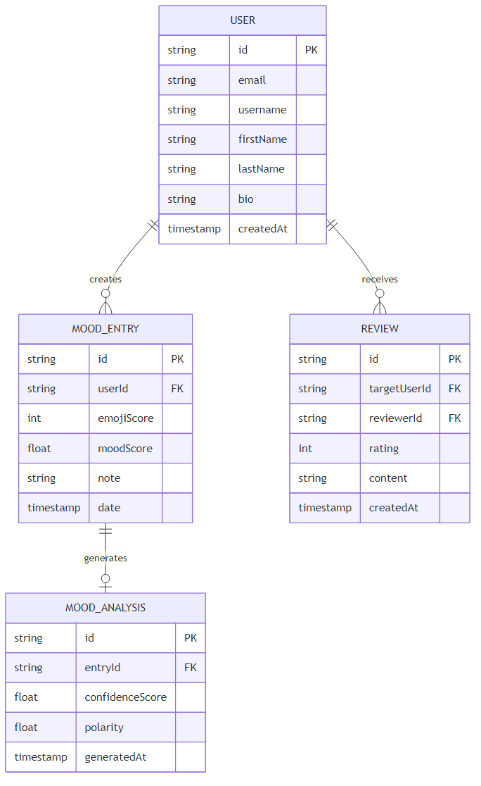
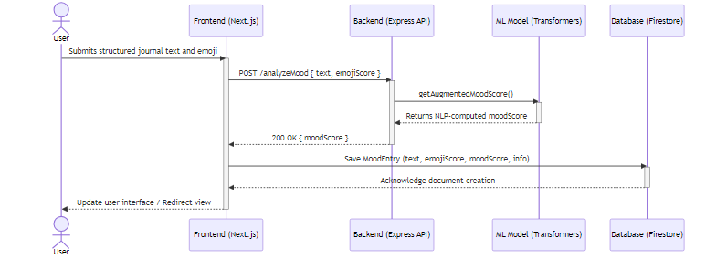

# MoodFLOW Architecture

## Overview
This document describes the system architecture of the application, including high-level components, data models, and system interactions.

## 1. High-Level Component Diagram

This diagram outlines the core components of the MoodFLOW application and their interactions. The **Frontend Application** (built with Next.js) serves as the main user interface, where users can interact with the system. It directly communicates with **Firebase Authentication** to manage user sign-ins and sessions securely. For application operations like retrieving mood trends or saving journal entries, the frontend sends API requests to the **Backend API**, powered by Express.js. The backend acts as the central coordinator—it reads and writes data to the **Firebase Firestore** database and delegates text sentiment analysis to the **Mood Analyzer**, a local machine learning model built using NLP Transformers.

## 2. Entity Diagram

This Entity-Relationship Diagram outlines the core data models supporting the mood tracking and community features within MoodFLOW. 
- **USER** represents registered user accounts alongside basic profile information (like email, first name, last name, and bio). 
- **MOOD_ENTRY** serves as the primary journal log, capturing inputs such as textual notes, explicitly designated emojis (emoji scores), and the date of the check-in to support historical tracking.
- **MOOD_ANALYSIS** captures the NLP-derived analytics (polarity and confidence sentiment scores) produced by the backend for a given journal entry, enabling automated mood scores.
- **REVIEW** represents feedback instances left on public profiles, facilitating community interaction features.

In this model, the `USER` entity has a one-to-many relationship with both `MOOD_ENTRY` (users log multiple entries over time) and `REVIEW` (users write and receive multiple reviews). Alongside this, each `MOOD_ENTRY` has an optional one-to-one relationship with `MOOD_ANALYSIS`, containing the sentiment results asynchronously generated by the AI services.

## 3. Call Sequence Diagram

This sequence diagram illustrates the step-by-step flow when a user logs a new mood entry containing free-form text. First, the **User** submits their journal text and an explicit emoji rating via the **Frontend (Next.js)** interface. The frontend then makes an HTTP `POST` call to the **Backend (Express API)** at the `/analyzeMood` endpoint. Next, the backend forwards the mood data to the local **ML Model (Transformers)** by calling `getAugmentedMoodScore()`, which performs natural language processing (NLP) to analyze sentiment and compute a unified `moodScore`. Once the NLP model returns this score, the backend replies to the frontend with a successful response containing the score. Subsequently, the frontend packages the user's text, chosen emoji, and the new `moodScore`, and calls the **Database (Firestore)** to save the new `MoodEntry` document. Finally, after the database confirms the creation of the document, the frontend updates the user interface to reflect the change.
